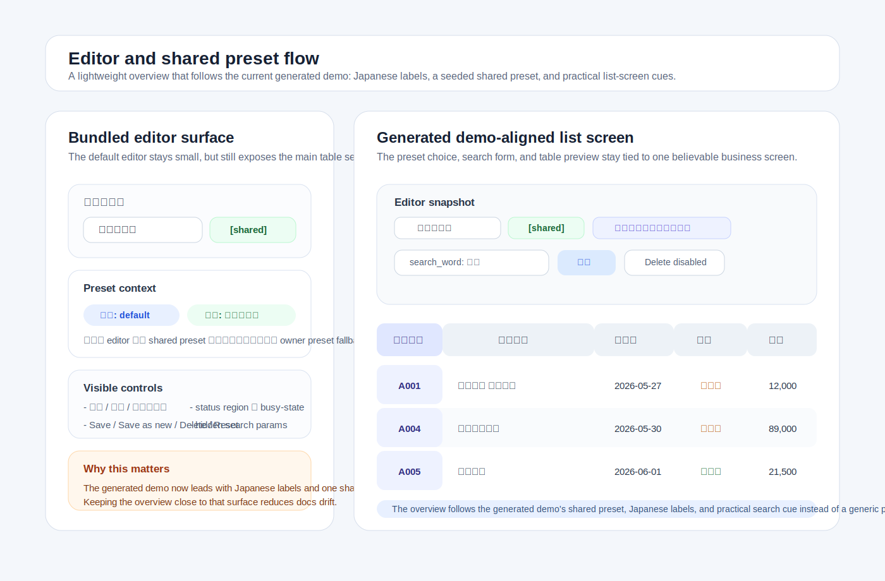

# Rails Table Preferences

Rails Table Preferences is a Rails engine/gem for saving and restoring table display preferences in Rails applications.

It is designed for business applications with many index tables, where users need to customize visible columns, column order, column width, text truncation, filter UI state, sort UI state, presets, fixed columns, and export column order per table.

## Visual overview

The bundled editor and demo screen are intentionally lightweight, but they still cover the main moments users need to evaluate before wiring the gem into a real business screen.



- [Visual overview](docs/visual_overview.md): representative screen illustrations for the editor, shared/scoped preset orientation, export-preview-related cues, filter/sort state, and pinned-column table layout.
- [Demo screen generator](docs/demo.md): generate the lightweight verification screen shown in the screenshots.

## Documentation

Focused documentation is available under [`docs/`](docs/index.md). Start with the short integration path below, then use the docs index for the full catalog of focused guides.

- [Quick start](docs/quick_start.md): the shortest path from installation to a working table preference UI.
- [日本語 quick start](docs/quick_start_ja.md): low-drift Japanese orientation for business-app integration; the English focused docs remain the detailed source of truth.
- [Production integration checklist](docs/production_integration_checklist.md): move from a working demo or quick start to a real host-app index screen.
- [Install path options](docs/install_paths.md): choose the smallest generator option set for default `stimulus-rails`, Vite/package entrypoint, skipped copied assets, or demo verification paths.
- [Support matrix](docs/support_matrix.md): Ruby/Rails runtime requirements, representative CI coverage, and host-app verification guidance for newer Rails releases.
- [Decision guide](docs/decision_guide.md): choose the right helper, adapter, or option for common use cases.
- [Demo screen generator](docs/demo.md): copy a lightweight browser verification screen into a host app.
- [Troubleshooting](docs/troubleshooting.md): common installation, Stimulus, CSS, API, filter/sort, scoped preset, and customization issues.

Core topic guides are grouped in the [docs index](docs/index.md), including resource tables, scoped presets, fixed columns, filter metadata, filter adapters, controller integration, export integration, accessibility, JavaScript entrypoints, mounted JSON API, manual QA, release checks, and package verification.

## Maintainer docs

- [Product Profile](Product%20Profile.md): concise maintainer-facing overview of the product surface, responsibility boundary, and release posture.
- [AGENTS.md](AGENTS.md): repository guardrails, source-of-truth order, and change boundaries for assisted maintenance work.
- [CHANGELOG.md](CHANGELOG.md): current unreleased scope and release narrative.

## Goals

- Save table display preferences per owner model, usually a user.
- Support column visibility, order, width, truncation, fixed/pinned metadata, and column group metadata.
- Support multiple named presets, default presets, shared presets, role defaults, and organization defaults.
- Support saved filter and sort UI state without becoming a query builder.
- Provide Rails helpers, controller helpers, a small JSON API, and a bundled Stimulus controller.
- Keep compatibility with existing `ColumnAdjustment`-style implementations.
- Allow host applications to customize ERB, CSS, JavaScript, and column-label resolution.
- Integrate with existing controller params, Ransack, host application search objects, and export code.

## Supported versions

Rails Table Preferences targets Rails 7.0 and later. See the [Support matrix](docs/support_matrix.md) for the Ruby/Rails runtime requirements, representative CI coverage, and newer host-app verification guidance.

Current representative CI compatibility coverage is:

- Rails 7.0
- Rails 7.1
- Rails 7.2
- Rails 8.0

That list is the current representative CI coverage in this repository, not a blanket promise that every newer host-app Rails release is continuously exercised here.

If you are evaluating the gem in a newer host app release such as Rails 8.1, treat it as additional host-app verification work for now before assuming parity with the CI-covered matrix.

A compact verification path for those newer host-app Rails releases is:

- [Demo screen generator](docs/demo.md): check the bundled editor surface, scoped preset examples, current scope context summary, and export payload preview in a lightweight browser-facing screen.
- [Production integration checklist](docs/production_integration_checklist.md): bridge the working demo or quick start into a real host-app index screen, including owner, route, query params, authorization, layout, and export boundaries.
- [Sandbox Rails app verification](docs/sandbox.md): confirm install, engine mount, copied/package JavaScript and CSS, and end-to-end preference wiring in a minimal Rails app.
- [Manual QA checklist](docs/manual_qa.md): finish in the real host app to verify authentication, authorization, layout, accessibility, and existing search/export integration.

The development Gemfile currently tracks Rails 8.0.x.

Ruby 3.1+ is required.

GitHub Actions keeps the default RSpec / JavaScript syntax / gem build / package verification job on both pushes and pull requests. Pull requests also run representative Rails compatibility lanes for Rails 7.0, Rails 7.1, Rails 7.2, and Rails 8.0 so lower-bound and current-baseline regressions are easier to spot before merge.

## Installation

Rails Table Preferences stores table preferences in the host application's primary database using a normal Rails migration.

```bash
bin/rails generate rails_table_preferences:install
bin/rails db:migrate
```

The generator creates:

- `config/initializers/rails_table_preferences.rb`
- `db/migrate/*_create_table_preferences.rb`
- `app/javascript/controllers/rails_table_preferences_controller.js`
- `app/assets/stylesheets/rails_table_preferences.css`

Mount the engine when using the bundled JSON API:

```ruby
# config/routes.rb
mount RailsTablePreferences::Engine, at: "/rails_table_preferences"
```

For Vite / `app/frontend/entrypoints/application.js`, register the packaged Stimulus controller explicitly:

```js
import { Application } from "@hotwired/stimulus"
import RailsTablePreferencesController from "rails_table_preferences/controller"

const application = Application.start()
application.register("rails-table-preferences", RailsTablePreferencesController)
```

If the host app already starts Stimulus elsewhere, reuse that existing `application` and only add `application.register(...)` here. Do not call `Application.start()` a second time from the same host app.

The package root also exposes a named export:

```js
import { RailsTablePreferencesController } from "rails_table_preferences"
```

When using Vite or another JS bundler, make sure the host app can resolve the gem's packaged `app/javascript/rails_table_preferences/*` files. A minimal Vite alias looks like this:

```ts
import { execSync } from "node:child_process"
import { fileURLToPath } from "node:url"

function gemPath(name: string) {
  return execSync(`bundle show ${name}`, { encoding: "utf-8" }).trim()
}

function gemJavaScriptPath(name: string, entrypoint: string) {
  return fileURLToPath(new URL(`app/javascript/${entrypoint}`, `file://${gemPath(name)}/`))
}

resolve: {
  alias: [
    { find: /^rails_table_preferences$/, replacement: gemJavaScriptPath("rails_table_preferences", "rails_table_preferences/index.js") },
    { find: /^rails_table_preferences\/controller$/, replacement: gemJavaScriptPath("rails_table_preferences", "rails_table_preferences/controller.js") }
  ]
}
```

See [JavaScript entrypoints](docs/javascript_entrypoints.md) for the default `stimulus-rails`, Vite, and custom bundler registration paths.

For a lightweight local browser verification screen, add `--with-demo`:

```bash
bin/rails generate rails_table_preferences:install --with-demo
```

Use `--with-demo-route` instead when you want the generator to copy the demo files and add the representative demo route to `config/routes.rb` in one step:

```bash
bin/rails generate rails_table_preferences:install --with-demo-route
```

If you used `--with-demo`, add the route manually. If you used `--with-demo-route`, the route is already added unless an equivalent route was already present:

```ruby
# config/routes.rb
get "/rails_table_preferences_demo/orders", to: "rails_table_preferences_demo/orders#index"
```

The copied demo reuses the same configured current-owner method as the normal editor flow. If the host app does not use `User` / `current_user`, set `config.owner_model` and `config.current_user_method` first, and make sure that method returns a persisted owner record before opening the demo screen.

See [Demo screen generator](docs/demo.md), [Quick start](docs/quick_start.md), [Production integration checklist](docs/production_integration_checklist.md), and [Sandbox Rails app verification](docs/sandbox.md) for the full local verification flow.

If preferences should belong to a model other than `User`, pass an owner model. The value can be singular or plural:

```bash
bin/rails generate rails_table_preferences:install --owner-model customers
bin/rails generate rails_table_preferences:install --owner-model client
```

`customers` generates `Customer` / `customer_id`; `client` generates `Client` / `client_id`. Override the generated foreign key only when needed:

```bash
bin/rails generate rails_table_preferences:install --owner-model customers --owner-foreign-key member_id
```

Skip copied assets when the host app wants to provide its own implementation:

```bash
bin/rails generate rails_table_preferences:install --skip-javascript
bin/rails generate rails_table_preferences:install --skip-stylesheets
```

You can also copy only the JavaScript controller or stylesheet later:

```bash
bin/rails generate rails_table_preferences:javascript
bin/rails generate rails_table_preferences:stylesheets
```

## Current scope

The current implementation includes the former v0.2 roadmap items in the initial v0.1 release target.

Included in v0.1 scope:

- Table-specific display settings
- Owner-specific preference persistence
- Shared presets
- Role and organization scoped presets/defaults
- Column visibility
- Column order
- Column width
- Text truncation metadata
- Fixed/pinned column metadata and CSS/JS hooks
- Column group metadata and grouping helper
- Multiple presets and default presets
- Ignored columns
- Configurable column labels through explicit labels, explicit i18n keys, database column comments, and optional locale/humanize fallbacks
- Filter metadata and filter panel UI foundation
- Sort metadata and sortable header click UI
- Controller params and Ransack adapters
- Controller/view helpers for existing search forms
- Convention-first resource table helpers for Active Record-backed tables
- Active Record column inference with `TableProfile` overrides for small per-screen deltas
- Renderer registries for filter/editor metadata integrations such as Rails Fields Kit
- Export payload helper for CSV, Excel, and report generation in the host app
- Baseline accessibility hooks for generated controls
- Rails engine structure
- View helpers
- Controller helpers
- Stimulus controller
- Package JavaScript entrypoints for Vite and other JS bundlers
- Install, JavaScript, stylesheet, and view generators
- Migration generator
- Compatibility path for existing JSON column-adjustment values
- Local demo and sandbox verification guidance
- Manual QA, troubleshooting, decision guide, scoped preset, fixed column, export, accessibility, release checklist, and package verification documentation

## Out of scope

Rails Table Preferences intentionally does not try to become:

- A generic ActiveRecord query builder
- A Ransack replacement
- A Datagrid replacement
- A Filterrific replacement
- A DataTables replacement
- An authorization system
- An automatic association/join inference system
- A pagination abstraction
- A CSV/Excel file generator
- A React or Vue component library
- A complete admin UI for managing shared, role, or organization presets

## Roadmap

### v0.1: Initial usable release

This is the current target version. It is intended to be usable in real Rails applications after local sandbox/manual verification.

Included scope:

- Column visibility, order, width, truncation, fixed/pinned metadata, overflow metadata, and column group metadata
- Spreadsheet-like auto-fit by double-clicking a column resize handle
- Owner, shared, role, and organization scoped presets
- Default preset resolution across owner, role, organization, and shared scopes
- Apply, Save, Save as new, Delete, and Reset actions
- Read-only handling for non-owner presets in the normal editor path
- Ignored columns
- Configurable column labels through explicit labels, explicit i18n keys, database column comments, and optional locale/humanize fallbacks
- Filter metadata and saved filter UI state
- Sort metadata and sortable header click UI
- Plain controller params adapter
- Ransack adapter
- Hidden fields helper for existing search forms
- Convention-first `resource_table_for` and `tree_resource_table_for` helpers with Active Record column inference
- `RailsTablePreferences::TableProfile` overrides for labels, filters, editors, display values, and column order
- Renderer registries for host-app filter/editor controls such as Rails Fields Kit
- Export payload helper for host app CSV/Excel/report code
- Rails helpers and Stimulus integration
- JavaScript package entrypoints for Vite / `app/frontend` registration
- JSON API for preference and preset persistence
- Migration, install, JavaScript, stylesheet, and view generators
- `--with-demo`, `--skip-javascript`, and `--skip-stylesheets` install options
- Owner model and owner foreign key generator/configuration options
- Existing `ColumnAdjustment` compatibility and import guidance
- Copy-based ERB, CSS, and JavaScript customization path
- Quick start, practical examples, troubleshooting, demo, sandbox, decision guide, scoped presets, fixed columns/groups, export integration, accessibility baseline, manual QA, release checklist, and package verification docs

Remaining before tagging v0.1:

Use the [Release checklist](docs/release_checklist.md) as the detailed release-readiness source of truth; this README list is the short summary before tagging.

- Confirm CI is green on the release commit
- Do one final sandbox/demo verification pass
- Inspect package contents with [Package verification](docs/package_verification.md)
- Move `CHANGELOG.md` entries from `[Unreleased]` to `0.1.0` when tagging
- Review README/docs consistency against the released behavior

### Later candidates

These are possible future directions, not committed release promises:

- More adapter examples for Datagrid, Filterrific, or host application search objects
- Richer filter widgets through integration with other UI helper gems
- A dedicated admin UI for shared, role, or organization preset management
- Optional browser/system test harness if maintenance cost is justified
- Broader Rails version matrix if needed
- Additional Japanese documentation for main user workflows

## Data model

The preferred model is an owner-aware table preference record with optional broader scopes.

By default the owner model is `User`, but it can be changed to `Customer`, `Client`, `Account`, or another application model.

```ruby
create_table :table_preferences do |t|
  t.references :user, null: true, foreign_key: true
  t.string :scope_type, null: false, default: "owner"
  t.string :scope_key
  t.string :table_key, null: false
  t.string :name, null: false, default: "default"
  t.json :settings, null: false
  t.boolean :default_flag, null: false, default: false
  t.timestamps
end

add_index :table_preferences,
          [:scope_type, :scope_key, :user_id, :table_key, :name],
          unique: true,
          name: "idx_table_preferences_scope_table_name"
```

`scope_type` can be:

- `owner`: personal preset for the owner record.
- `shared`: global preset available to all owners.
- `role`: role-specific preset, matched through `scope_context_method`.
- `organization`: organization-specific preset, matched through `scope_context_method`.

The owner reference is nullable because shared, role, and organization presets are not owned by a single user.

With `--owner-model customers`, the generated migration uses `customer_id` instead of `user_id`:

```ruby
create_table :table_preferences do |t|
  t.references :customer, null: true, foreign_key: true
  # ...
end

add_index :table_preferences,
          [:scope_type, :scope_key, :customer_id, :table_key, :name],
          unique: true,
          name: "idx_table_preferences_scope_table_name"
```

The settings payload includes column display preferences plus neutral filter and sort UI state:

```json
{
  "columns": [
    {
      "key": "customer_code",
      "visible": true,
      "order": 10,
      "width": 120,
      "truncate": 20,
      "pinned": false
    }
  ],
  "filters": {
    "customer_name": {
      "operator": "contains",
      "value": "山田"
    }
  },
  "sorts": [
    {
      "key": "delivery_date",
      "direction": "desc"
    }
  ]
}
```

Existing `ColumnAdjustment` style keys are accepted by the normalizer:

```json
{
  "columns": [
    {
      "column_name": "customer_code",
      "display_flag": true,
      "display_order": 10,
      "width": 120
    }
  ]
}
```

## Configuration

Default configuration:

```ruby
RailsTablePreferences.configure do |config|
  config.table_name = "table_preferences"
  config.owner_model = :users
  config.label_resolution = %i[label i18n_key column_comment]
  config.unresolved_label_behavior = :hide
  config.parent_controller_class_name = "ApplicationController"
  config.current_user_method = :current_user
  config.scope_context_method = nil
  config.mount_path = "/rails_table_preferences"
  config.editor_partial = "rails_table_preferences/editor"
end
```

`owner_model` accepts a `String` or `Symbol`, singular or plural:

```ruby
config.owner_model = :customers # Customer / customer_id
config.owner_model = "clients"  # Client / client_id
config.owner_model = :account   # Account / account_id
```

Backward-compatible aliases are available:

```ruby
config.user_class_name = "User"
config.user_model = :users
config.account_model = :accounts
```

Override the foreign key only when the default is not correct:

```ruby
config.owner_foreign_key = :member_id
# Backward-compatible alias:
config.user_foreign_key = :member_id
```

Configure `scope_context_method` when shared, role, or organization presets should be resolved from the current request context:

```ruby
RailsTablePreferences.configure do |config|
  config.scope_context_method = :table_preference_scope_context
end

class ApplicationController < ActionController::Base
  private

  def table_preference_scope_context
    {
      roles: current_user.roles.pluck(:key),
      organization: current_user.organization_id
    }
  end
end
```

The first implementation assumes a primary application database. Applications with different owner model names can configure the owner model and foreign key before using the model. If the engine is mounted at a different path, set `mount_path` to the same value.

## Column definitions

Column labels are the user-facing names shown in the preference editor. By default they are resolved in this order:

1. Explicit `label:`
2. Explicit `i18n_key:`
3. Database column comment from `model.columns_hash[key].comment`

If no label can be resolved, the column is hidden from Rails Table Preferences, the same as `ignored: true`. This prevents columns that have not been marked as user-facing from appearing in the editor.

Examples:

```ruby
columns = [
  table_preferences_column(:order_no, label: "受注番号", fixed: true, default_width: 120),
  table_preferences_column(:customer_code, model: Order, group: { key: :customer, label: "得意先情報" }),
  table_preferences_column(:customer_name, model: Order, group: { key: :customer, label: "得意先情報" }, overflow: :ellipsis),
  table_preferences_column(:delivery_date, i18n_key: "orders.index.columns.delivery_date", sortable: true),
  table_preferences_column(:memo, label: "備考", filter: { type: :text, param: :memo }, overflow: :wrap)
]
```

Column resize handles support two actions:

- drag: manually resize the column
- double-click: auto-fit to the currently rendered header/body cell content, similar to spreadsheet applications

The auto-fit result is saved as the normal column `width` when the user saves the preset. The auto-fit calculation is based on currently rendered cells, so paginated or virtualized tables are fitted to the visible page.

Use `overflow:` to control text that is wider than the configured column width:

```ruby
table_preferences_column(:customer_name, label: "得意先名", default_width: 200, overflow: :ellipsis)
table_preferences_column(:note, label: "備考", default_width: 320, overflow: :wrap)
table_preferences_column(:code, label: "コード", default_width: 120, overflow: :clip)
```

Supported values are `:ellipsis`/`:truncate`, `:clip`, `:wrap`, and `:nowrap`. `default_truncate:` remains available as a backward-compatible way to enable ellipsis behavior.

Host apps that want Rails-style attribute locale keys can opt in by adding the locale rules:

```ruby
RailsTablePreferences.configure do |config|
  config.label_resolution = %i[
    label
    i18n_key
    column_comment
    activerecord_attribute_i18n
    activemodel_attribute_i18n
    attribute_i18n
  ]
end
```

Host app locale example:

```yaml
ja:
  activerecord:
    attributes:
      order:
        customer_code: 得意先コード
        customer_name: 得意先名
  orders:
    index:
      columns:
        delivery_date: 納品日
```

If you want unresolved columns to use the old permissive fallback style, add `:humanize` or set `unresolved_label_behavior`:

```ruby
RailsTablePreferences.configure do |config|
  config.label_resolution = %i[label i18n_key column_comment humanize]
  # or:
  config.unresolved_label_behavior = :humanize
end
```

## Ignored columns

Use ignored columns for fields that should not appear in the user-facing column editor, even if the table or saved settings contain them.

```ruby
columns = [
  table_preferences_column(:customer_code, label: "得意先コード"),
  table_preferences_column(:internal_cost, label: "内部原価", ignored: true),
  table_preferences_column(:secret_note, label: "秘密メモ", ignore: true)
]
```

Or pass a render-time blacklist:

```erb
<%= table_preferences_editor(
  table_key: :orders,
  columns: columns,
  ignored_columns: [:internal_cost, :secret_note]
) %>
```

Columns whose labels cannot be resolved are also removed from the editor and settings payloads by default.

Ignored columns are removed from `columns_json` and are also filtered out of the initial `settings_json`. This prevents old saved preferences from reintroducing a column that the host application has since hidden from users.

This is a UI/display protection mechanism. Sensitive values should still be protected by normal authorization, query selection, and view rendering rules in the host application.

## Filters and sorts

Filters and sorts are treated as UI state and adapter params, not as database query execution. See:

- [Filter metadata](docs/filter_metadata.md)
- [Filter adapters](docs/filter_adapters.md)
- [Controller integration](docs/controller_integration.md)

Example column metadata:

```ruby
columns = [
  table_preferences_column(
    :customer_name,
    label: "得意先名",
    filter: { type: :text, param: :search_word },
    sortable: true,
    overflow: :ellipsis
  ),
  table_preferences_column(
    :delivery_date,
    label: "納品日",
    filter: { type: :date, from_param: :from_date, to_param: :to_date },
    sortable: true
  )
]
```

Existing controller params integration:

```ruby
preference_params = rails_table_preference_params(
  table_key: :warehouse_stocks,
  columns: columns
)

merged_params = params.to_unsafe_h.merge(preference_params)

@warehouse_stocks = WarehouseStock
  .search(merged_params)
  .order_by(merged_params["sort"] || params[:sort])
```

Existing search form integration:

```erb
<%= table_preferences_hidden_fields(
  settings: @table_preference_settings,
  columns: columns
) %>
```

## Export integration

Rails Table Preferences does not generate CSV, Excel, or report files, but it can provide an ordered export payload:

```ruby
payload = rails_table_preference_export_payload(
  table_key: :orders,
  columns: columns,
  name: params[:table_preference_name]
)

payload["column_keys"]
payload["headers"]
payload["columns"]
```

See [Export integration](docs/export_integration.md).

## Host app customization

### ERB

The editor is rendered through a partial. By default:

```ruby
config.editor_partial = "rails_table_preferences/editor"
```

To customize the markup, copy the default partial into the host application:

```bash
bin/rails generate rails_table_preferences:views
```

Then edit:

```text
app/views/rails_table_preferences/_editor.html.erb
```

You can also provide a custom partial per call:

```erb
<%= table_preferences_editor(
  table_key: :orders,
  columns: columns,
  partial: "shared/table_preferences_editor"
) %>
```

### CSS

The default stylesheet is copy-based and intentionally minimal.

```bash
bin/rails generate rails_table_preferences:stylesheets
```

The file is copied to:

```text
app/assets/stylesheets/rails_table_preferences.css
```

Host applications can freely edit or override the copied stylesheet.

### JavaScript

Rails Table Preferences supports both copy-based and package-entrypoint Stimulus integration.

The install generator copies the bundled Stimulus controller into the host application:

```text
app/javascript/controllers/rails_table_preferences_controller.js
```

For Rails applications using the default `stimulus-rails` manifest loader, files ending in `_controller.js` under `app/javascript/controllers` are registered automatically. In that setup, no extra import is needed after running the install generator.

For Vite / `app/frontend` apps, import and register the package entrypoint:

```js
import RailsTablePreferencesController from "rails_table_preferences/controller"
application.register("rails-table-preferences", RailsTablePreferencesController)
```

If the host app already starts Stimulus in another file, reuse that same `application` and only add `application.register(...)` in the current entrypoint.

Vite does not resolve Ruby gem `app/javascript` files automatically. Add aliases or an equivalent resolver for `rails_table_preferences` and `rails_table_preferences/controller` so the bundler can find the packaged gem entrypoints.

For jsbundling or a custom Stimulus setup that uses the copied file, import and register the copied controller manually:

```js
import RailsTablePreferencesController from "./controllers/rails_table_preferences_controller"
application.register("rails-table-preferences", RailsTablePreferencesController)
```

If the host application wants to maintain its own JavaScript implementation, skip copying during install and register a controller with the same Stimulus name:

```bash
bin/rails generate rails_table_preferences:install --skip-javascript
```

Rails Table Preferences does not require importmap-specific setup.

See [JavaScript entrypoints](docs/javascript_entrypoints.md) for import paths and resolver examples, and [JavaScript controller notes](docs/javascript_controller.md) for the bundled controller's responsibilities and event boundaries.

## JSON API

The mounted engine exposes a small JSON API for available table preferences and presets.

```http
GET    /rails_table_preferences/preferences/:table_key
POST   /rails_table_preferences/preferences/:table_key
GET    /rails_table_preferences/preferences/:table_key/:name
PATCH  /rails_table_preferences/preferences/:table_key/:name
PUT    /rails_table_preferences/preferences/:table_key/:name
DELETE /rails_table_preferences/preferences/:table_key/:name
```

`name` is optional for single-preset operations and defaults to `default`. `POST` accepts `name`, `scope_type`, `scope_key`, `settings`, and optional `default`. `PATCH` and `PUT` also accept optional `default` to mark a preset as the default for that table and scope.

Example request body:

```json
{
  "name": "inspection",
  "default": true,
  "settings": {
    "columns": [
      {
        "key": "customer_code",
        "visible": true,
        "order": 10,
        "width": 120,
        "truncate": 20,
        "pinned": false
      }
    ]
  }
}
```

Example response:

```json
{
  "table_key": "orders",
  "name": "default",
  "default": false,
  "scope_type": "owner",
  "scope_key": "",
  "scope_label": "owner",
  "editable": true,
  "settings": {
    "columns": [],
    "filters": {},
    "sorts": []
  }
}
```

## Usage direction

Current helper direction:

```erb
<% columns = [
  table_preferences_column(:order_no, label: "Order No.", default_order: 10, default_width: 120, fixed: true),
  table_preferences_column(:customer_code, label: "Customer Code", default_order: 20, default_width: 120, group: { key: :customer, label: "Customer" }),
  table_preferences_column(:customer_name, label: "Customer Name", default_order: 30, default_width: 240, default_truncate: 30, group: { key: :customer, label: "Customer" })
] %>

<%= table_preferences_editor(table_key: :orders, columns: columns, title: "Order table settings") %>

<%= table_preferences_table_tag(table_key: :orders, columns: columns, class: "table") do %>
  <thead>
    <tr>
      <th data-rails-table-preferences-column-key="order_no">Order No.</th>
      <th data-rails-table-preferences-column-key="customer_code">Customer Code</th>
      <th data-rails-table-preferences-column-key="customer_name">Customer Name</th>
    </tr>
  </thead>
  <tbody>
    <% @orders.each do |order| %>
      <tr>
        <td data-rails-table-preferences-column-key="order_no"><%= order.order_no %></td>
        <td data-rails-table-preferences-column-key="customer_code"><%= order.customer_code %></td>
        <td data-rails-table-preferences-column-key="customer_name"><%= order.customer_name %></td>
      </tr>
    <% end %>
  </tbody>
<% end %>
```

The bundled Stimulus controller applies saved `visible`, `order`, `width`, `truncate`, `pinned`, filter, and sort state to cells marked with `data-rails-table-preferences-column-key`.

## Legacy ColumnAdjustment import

Applications with an existing `ColumnAdjustment` model can import those records into `table_preferences`:

```bash
bin/rails rails_table_preferences:legacy:import_column_adjustments
```

Run a dry run first:

```bash
DRY_RUN=1 bin/rails rails_table_preferences:legacy:import_column_adjustments
```

If legacy records do not have `user`, `user_id`, `create_user`, or `create_user_id`, provide a fallback owner:

```bash
USER_ID=1 bin/rails rails_table_preferences:legacy:import_column_adjustments
```

The importer reads `setting_name`, `table_name`, and `value`, accepts legacy column keys such as `column_name`, `display_flag`, and `display_order`, and stores normalized settings in `table_preferences`.

## Development

Install dependencies:

```bash
bundle install
```

Run the Ruby test suite:

```bash
bundle exec rspec
```

Check the bundled Stimulus controller for JavaScript syntax errors:

```bash
node --check app/javascript/controllers/rails_table_preferences_controller.js
```

The current minimum local verification before pushing changes is:

```bash
bundle exec rspec
node --check app/javascript/controllers/rails_table_preferences_controller.js
bundle exec rake build
```

GitHub Actions runs the default RSpec / JavaScript syntax / gem build / package verification job on both pushes and pull requests. Pull requests also run representative Rails compatibility lanes with `BUNDLE_GEMFILE=gemfiles/rails_7_0.gemfile`, `BUNDLE_GEMFILE=gemfiles/rails_7_1.gemfile`, `BUNDLE_GEMFILE=gemfiles/rails_7_2.gemfile`, and `BUNDLE_GEMFILE=gemfiles/rails_8_0.gemfile`.

Before tagging or publishing a release, also inspect the built package with [Package verification](docs/package_verification.md) and run the broader release checks in [Release checklist](docs/release_checklist.md).

## Development status

This gem is in active initial development. The current test suite is expected to pass locally, and the bundled Stimulus controller should pass `node --check`.

## License

MIT License.