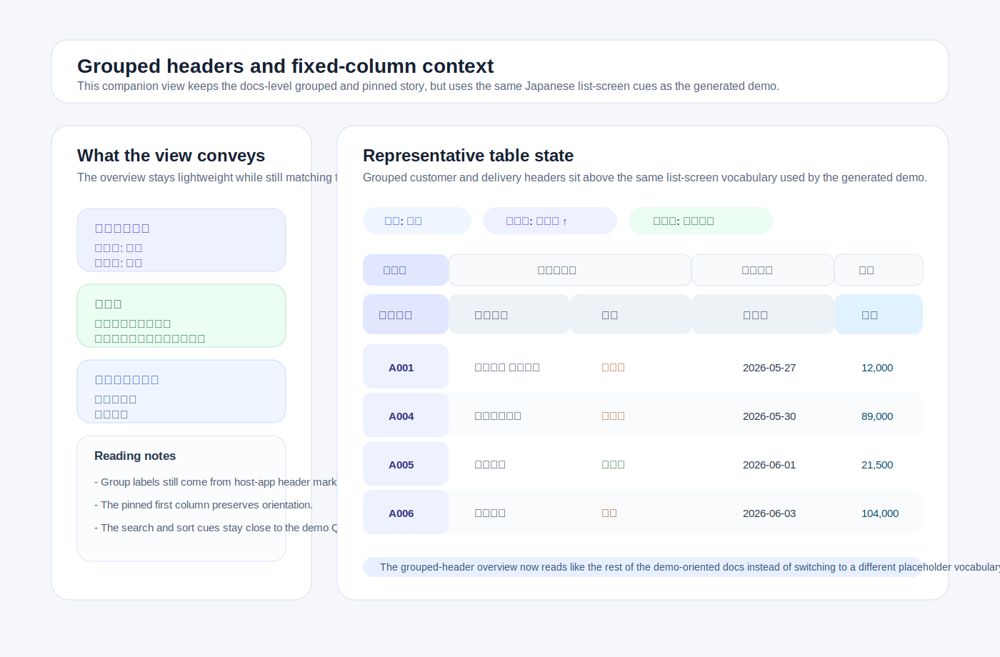

# Visual overview

This page gives a quick visual reference for the bundled demo surface before you copy the demo files into a host application.

The images below stay intentionally lightweight, but they now mirror the current generated demo more closely: Japanese labels, owner switch links, the seeded shared preset `共有ビュー`, scoped preset context, practical search/sort cues, and the same dense list-screen posture used elsewhere in the docs. Use the generated demo screen as the behavioral source of truth and treat these images as a compact orientation aid rather than a full QA substitute.

The current generated demo keeps the longer orientation copy folded, then puts the editor, search form, and table surface before the owner/scope/export/async support sections. Start with those first-screen controls when you want to check the main scan path quickly, then use the support sections for scoped preset, export payload, reset, and failure-recovery checks.

## Editor and shared preset flow


What this view highlights:

- the bundled editor layout above the table
- the seeded `共有ビュー [shared]` path and the normal owner-facing editor state
- Japanese demo labels, status copy, and practical sample rows from the generated screen
- owner, search-form, and preset context staying tied to the same list screen

What the current generated demo adds beyond this compact screenshot:

- a `Current owner` summary plus `Host app owner`, `Demo owner A`, and `Demo owner B` links so you can compare saved presets across owner records without editing authentication code between requests
- a `Current scope context` summary that tells you whether the request is still `owner-only` or already includes representative `roles` / `organization` keys
- seeded role and organization preset examples that appear as `担当ビュー [role:operations]` and `東京組織ビュー [organization:tokyo-hq]` when the host app returns the matching scope context
- an export payload preview that shows the ordered `headers` and `column_keys` produced by the current saved visibility/order state
- a `Demo state reset` support section for returning owner-scoped demo presets to the seeded baseline before repeating scoped precedence checks
- an `Async failure check` support section for forcing one preset save, load, or delete request to fail once, then retrying the same action to confirm recovery

## Grouped headers and fixed-column context



What this view highlights:

- grouped-header and pinned-column guidance using the same Japanese business-table vocabulary as the demo docs
- `東京` search and `納品日` sort cues that match the demo-oriented QA flow
- fixed/pinned metadata staying visible without implying that the gem owns final host-app markup
- a visible boundary after the fixed `受注番号` column, so the static overview shows where host-app scroll polish may need a separator or shadow
- the same dense list-screen posture used across the quick-start and maintenance docs

## Evidence boundary

Use this page as an evidence boundary for the README first visual, the SVG captions, and the generated demo source of truth. The SVGs do not need to reproduce every current demo support section. They should keep the first-screen orientation clear and intentionally leave detailed owner, scope, export, reset, and async-failure behavior to the generated demo page.

Use this quick matrix when deciding what evidence a PR or release-prep check should record:

| Change type | Evidence to record | Browser-capable handoff |
| --- | --- | --- |
| Wording-only changes to this page, captions, checklist text, or notes that keep the SVGs in their compact orientation role | Source-only inspection is enough. Record the docs or source files compared and the current-demo cues intentionally left outside the SVGs. | Not needed unless the text claims a rendered state. |
| Replacement of either SVG, a changed README first-visual promise, or a claim about spacing, overlap, clipping, or visual hierarchy | Render or open the artifact when available, then record the changed visual/doc paths and the source-of-truth docs compared. | Required when rendered confirmation is unavailable or the acceptance criteria ask for rendered proof. |
| Generated demo layout, first-screen ordering, owner/scope/export/reset/async support-section behavior, or runtime UI behavior | Use the generated demo page and the relevant focused docs as the behavior source of truth. Record whether evidence was rendered, source-only, or substituted. | Leave the exact remaining screen, viewport, or support-section check for review when this environment cannot render it. |

For narrow PR comments, keep the handoff short enough to paste directly under the review summary:

```markdown
### Visual evidence handoff

- Artifact / changed paths:
- Checked in this PR: source-only / rendered / browser-capable
- Source-of-truth docs compared:
- Not checked here:
- Remaining browser-capable handoff:
- Generated demo cues intentionally left outside the compact SVG:
```

Use `source-only` when you compared Markdown, SVG text, captions, or package paths without opening the rendered artifact. Use `rendered` only after opening the changed visual artifact. Use `browser-capable` only after checking the relevant browser viewport, support section, or generated demo screen.

Do not describe source inspection as rendered proof. Use [Manual QA smoke matrix for PRs](manual_qa_pr_smoke_matrix.md#pr-category-matrix) and its static visual docs row for the general evidence format.

## Notes

- The generated demo screen remains the best place to verify actual behavior in a browser.
- Package verification confirms that these SVG files ship with the gem; it does not render the images or prove that the rendered view still matches the captions above.
- 2026-06-13 source-only drift check: the current captions and SVG text still describe the generated demo's landed orientation cues, including the folded intro copy, editor/search/table first-screen path, owner and scope summaries, shared/role/organization preset examples, export payload preview, reset support, async failure support, `東京` search cue, `納品日` sort cue, and fixed `受注番号` boundary. The SVG files were not replaced in that check because the lightweight illustration role still matches the README and docs index promise.
- Recheck this page whenever the demo generator, seeded demo presets, support sections, README first visual copy, or either `visual-overview-*.svg` file changes. If the images stay unchanged, record whether the comparison was source-only or rendered, and list any current-demo cues that were intentionally left out of the compact overview.
- When a PR or release note changes these images, the surrounding captions, or the README first-visual promise, record the changed visual/doc paths, whether the README image and this page's captions or highlighted points were compared, and whether you used rendered visual confirmation or source-only inspection.
- Use [Demo support section smoke boundary](demo_support_section_smoke.md) when a PR or release-prep check mentions the `Demo state reset`, `Async failure check`, or visual overview support-section cues, so rendered evidence, source-only inspection, and browser-capable handoff stay separate.
- Keep that demo support smoke note as a focused evidence aid reached from this visual overview page. Do not list it as a full-catalog docs index entry or add it to package verification required paths unless it is promoted from PR/release-prep evidence guidance into a primary packaged documentation entrance.
- Start with [Demo screen generator](demo.md) when you want the current owner links, current scope context summary, scoped preset examples, and export payload preview that extend the screenshots on this page.
- Use [Reset demo state before scoped checks](demo.md#reset-demo-state-before-scoped-checks) when previous save testing should be cleared before role / organization precedence checks.
- Use [Reproduce one async failure quickly](demo.md#reproduce-one-async-failure-quickly) when you need to confirm the status region and controls recover after one forced preset request failure.
- Use [Scoped presets](scoped_presets.md) for the default-resolution rules behind the selector labels, and [Fixed columns and column groups](fixed_columns_and_groups.md) for the pinned/grouped markup details behind the second image.
- The exact visual polish still comes from the host application after copying the ERB, CSS, or Stimulus controller.
